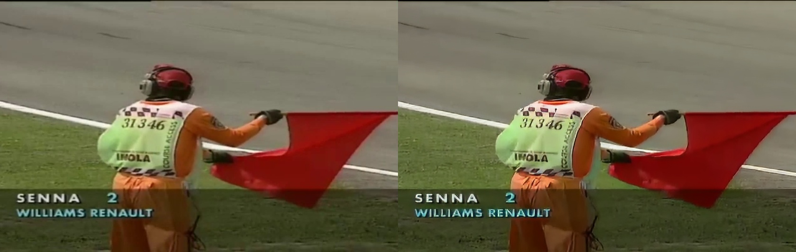
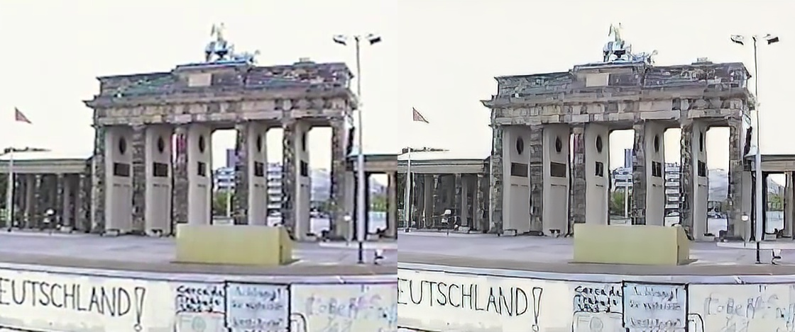
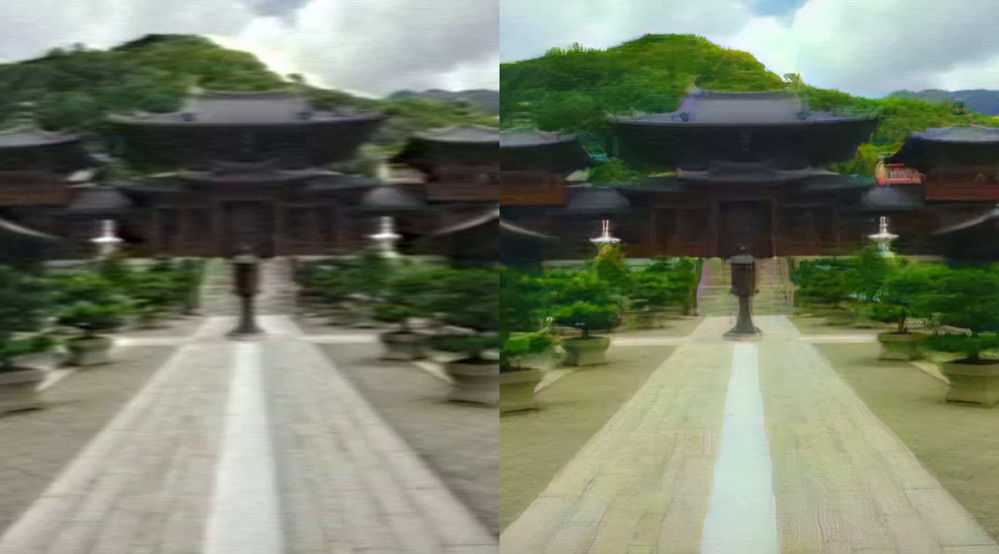
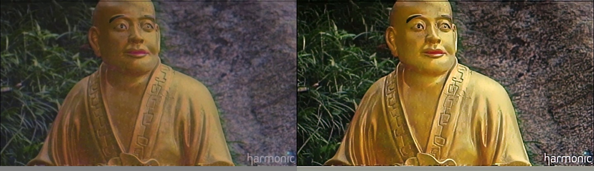
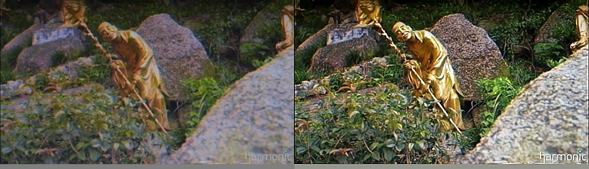
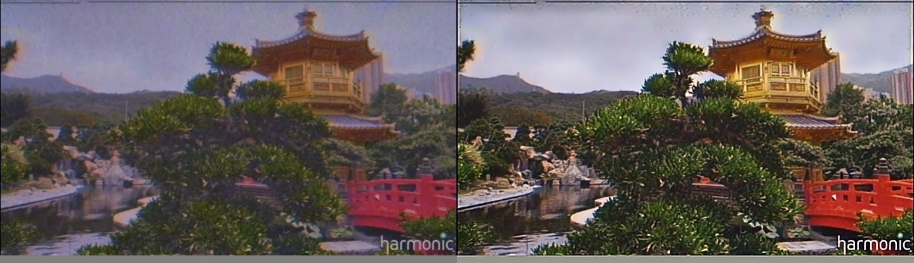

# U-nets for Video restoration and visual quality enhancement of old footage

<video src="pics/f10000-0180.mp4"></video>

https://github.com/user-attachments/assets/120661b7-e982-4d1c-9f0a-ab02662d73ec


<video src="pics/f10455-0621.mp4"></video>


https://github.com/user-attachments/assets/b8d84517-4d0f-4960-b6e2-b7ea0bc73325


[](https://www.youtube.com/embed/FCY9JW-iUN0?si=hKigchXoQR0BGUMk)


#### Requirements:

- Installing CUDA with torchvision and torch: `$ conda install pytorch torchvision cudatoolkit=10.2 -c pytorch -c`
- [LPIPS](https://github.com/richzhang/PerceptualSimilarity): `$ pip install lpips`
- install OpenCv with $ pip install opencv-python
- FFMpeg compiled with H.265 codec and also VMAF metric. My version is included in the `helper/` directory but it won't
  likely work. For references
  check [the official compilation guide](https://trac.ffmpeg.org/wiki/CompilationGuide/Ubuntu) and
  the [VMAF GitHub Repository](https://github.com/Netflix/vmaf).

#### The dataset:

First, the dataset we use for training is the [BVI-DVC](https://arxiv.org/pdf/2003.13552). For preparing the dataset
there are some helper script that you can found in helpers directory.
`compress_train_videos.sh` for spatially compressing and encoding each video, then with `extract_train_frames.sh` the
dataset can be prepared.   
The train dataset should follow this naming scheme (assuming the videos are encoded with CRF 23):

```
  [DATASET_DIR]/
      HQ/
          [clipName1]/
              _001.jpg
              _002.jpg
              ...
              _064.jpg
          [clipName2]/
              ...
          [clipNameN]/
              ...
      LR_FullHD/set1/
          [clipName1]/
              _001.jpg
              _002.jpg
              ...
              _064.jpg
          [clipName2]/
              ...
          [clipNameN]/
              ...
      LR_FullHD/set2/
              ...
       LR_HDReady/set1/
          [clipName1]/
              _001.jpg
              _002.jpg
              ...
              _064.jpg
          [clipName2]/
              ...
          [clipNameN]/
              ...
      LR_HDReady/set2/

```

#### Training the model:

To train my model described in my thesis, you can use this command.

```
$ python train.py --dataset ./dataset/training_set --set set1 --res FullHD
 --device 0 --export ./models/ --epochs 80 --arch sarunet --upscale 2
```

For more information about the other parameters, inspect `utils.py` or try

```
& python train.py -h
```

Ultimately will be printed on screen the experimental results, and also will be saved a .csv file contained these infos.

#### Inference with the model using `restauration.py`

You can use the script `restauration.py` for using the model to upscale and restoration your old video. Examples:

- For 2x upscaling
    ```
    $ python restauration.py --n_filters 64 --model models/sarunet_epoch79_ssim0.5952_lpips0.3430_resFullHD.pkl
     --clipname pathTovideo.mp4  --device 0 --arch sarunet --output outputFolder

    ```

You will notice that by default the output is split in two halves: on the left there is the input, on the right there is
the upscaled and restored version.


## Examples






